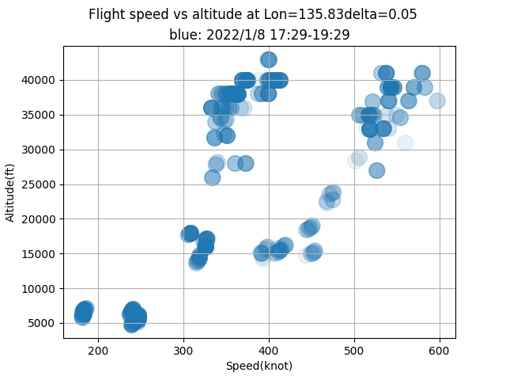

# adsb-speed-altitude.py 
ADSB flight data slicer for speed and altitude by python and pandas

## What this program shows

I'm interested in 3D route of aircrafts flying over my head. Mostly to/from East/West
along Western Japan. 
This program generates speed-altitude scatter plot of aircrafts at specified longitude.

We can see two groups of aircraft , one with 550knot and another group with 350knot at altitude 40000ft.
The difference comes from jetstream blowing from west to east over Japan.
Estimated jetstream is about 100knot=180km/h.

## How to do
Prepare CSV data as follows

Install RTL-SDR software on Jetson or Raspberry pi or Windows. (I used Jetson nano)

Install dump1090 from https://github.com/MalcolmRobb/dump1090

Run dump1090 as a network server.

	 $ ./dump1090 --net

Open another terminal, run nc command for 7200sec to make csv

	 $ timeout 7200 nc localhost 30003 > adsb1.csv

<pre>
MSG,3,111,11111,780A7B,111111,2022/01/08,17:29:07.820,2022/01/08,17:29:07.777,,36000,,,33.96786,134.76025,,,,,,0
MSG,4,111,11111,862338,111111,2022/01/08,17:29:07.833,2022/01/08,17:29:07.778,,,436,72,,,3392,,,,,0
MSG,4,111,11111,8518D0,111111,2022/01/08,17:29:07.848,2022/01/08,17:29:07.840,,,365,223,,,-1664,,,,,0
MSG,3,111,11111,850E14,111111,2022/01/08,17:29:07.853,2022/01/08,17:29:07.841,,40000,,,34.04984,136.10842,,,,,,0
MSG,4,111,11111,850E14,111111,2022/01/08,17:29:07.873,2022/01/08,17:29:07.842,,,371,236,,,0,,,,,0
MSG,4,111,11111,850E14,111111,2022/01/08,17:29:08.273,2022/01/08,17:29:08.236,,,371,236,,,0,,,,,0
MSG,3,111,11111,850E14,111111,2022/01/08,17:29:08.763,2022/01/08,17:29:08.758,,40000,,,34.04892,136.10687,,,,,,0
</pre>
shows ICAO=850E14, speed=371 , altitude=40000, lat=34.04892, lon=136.10678

Edit this code and change csv filename.

	 $ chmod +x adsb-speed-altitude.py

Change "baselon" to your neighbor longitude to get a slice at specified longitude.

Output is a speed vs altitude plot at specified longitude in  adsb5.jpg

LICENSE Apache 2.0

copyright 2023 by coniferconifer