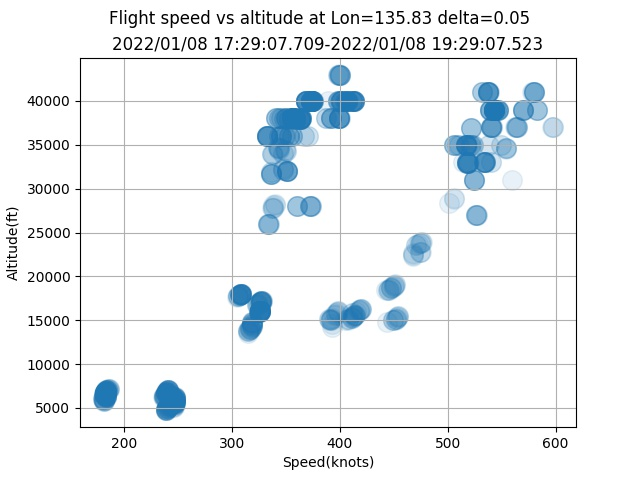

# adsb-speed-altitude.py 
ADSB flight data slicer for speed and altitude by python and pandas

## What this program shows

I'm interested in 3D route of aircrafts flying over my head. Mostly to/from East/West
along Western Japan. 
This program generates speed-altitude scatter plot of aircrafts at specified longitude.

We can see two groups of airliner , one with 550knot and another group with 350knot at altitude 40000.
The difference comes from jetstream from west to east.
Estimated jetstreams is about 100knot=180km/h.

## How to do
Prepare CSV data as follows

Install RTL-SDR software on Jetson or Raspberry pi or Windows. (I used Jetson nano)

Install dump1090 from https://github.com/MalcolmRobb/dump1090

Run dump1090 as a network server.

	 $ ./dump1090 --net

Open another terminal, run nc command for 7200sec to make csv

	 $ timeout 7200 nc localhost 30003 > adsb1.csv

Edit this code and change csv filename.

	 $ chmod +x adsb-speed-altitude.py

Change "baselon" to your neighbor longitude to get a slice at specified longitude.

Output is a speed vs altitude plot at specified longitude in  adsb5.jpg

LICENSE Apache 2.0

copyright 2023 by coniferconifer